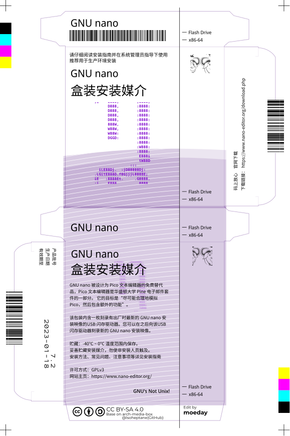

# GNU nano 盒装安装媒介

根据[Arch Linux 盒装安装媒介](https://github.com/Isoheptane/arch-media-box)内的box_source.svg文件通过Figma直接修改过来

## 使用
不知是否可以打印（ε=ε=ε=┏(゜ロ゜;)┛逃
## 许可
本作品采用 [CC BY-SA 4.0](https://creativecommons.org/licenses/by-sa/4.0/) 许可协议进行许可。 